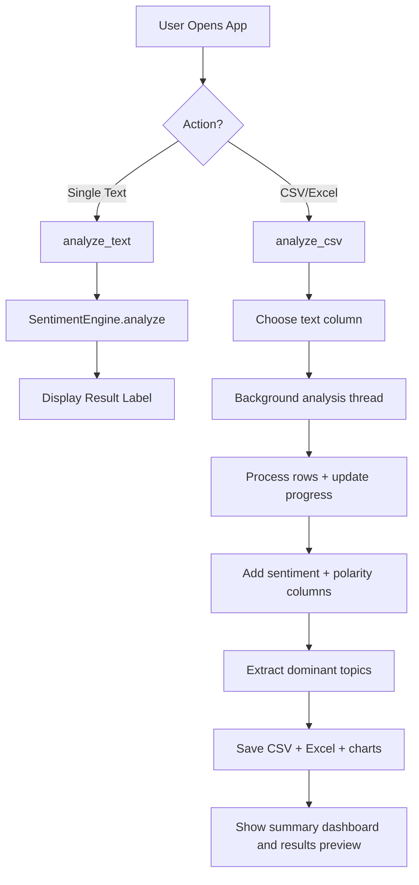

***

# 🧠 Code Explanation — Sentiment Analyzer Pro

This document explains how the current project works internally. The program accepts either typed text or uploaded CSV/Excel data, classifies sentiment, and then saves the results with charts and topic summaries for local review.

---

## 🚀 High-Level Overview
At its simplest, the app works like this:
**Input (Text / CSV / Excel)** $\rightarrow$ **Sentiment Engine (VADER)** $\rightarrow$ **Topic Extraction (TF-IDF + NMF)** $\rightarrow$ **Output (GUI / CSV / Excel / Charts)**.

The app is designed to be responsive, so large files are processed in a background thread to avoid freezing the UI while analysis runs.

---

## 📦 The Tech Stack (Libraries)

| Library | Role | Technical Purpose |
|---|---|---|
| `tkinter` | **The Interface** | Creates the desktop window, buttons, labels, dialogs, and layout. |
| `pandas` | **The Data Layer** | Reads CSV/Excel files, manages columns, and writes result files. |
| `nltk` | **The Sentiment Engine** | Provides VADER for sentiment scoring and lexical analysis. |
| `scikit-learn` | **The Topic Modeler** | Uses TF-IDF plus NMF to find dominant topics in text. |
| `matplotlib` | **The Visualizer** | Creates pie charts, histograms, and topic-frequency graphs. |
| `threading` | **The Background Worker** | Keeps the GUI responsive while long analyses run. |
| `os` & `datetime` | **The Organizer** | Creates output folders and timestamped filenames. |

---

## 🛠️ SECTION 1: The Sentiment Engine

The main logic is placed inside the `SentimentEngine` class so it can be reused cleanly for both single text analysis and bulk file processing.

```python
class SentimentEngine:
    def __init__(self):
        self.sia = SentimentIntensityAnalyzer()
        self.neutral_overrides = {
            "okay", "ok", "fine", "alright", "average", "moderate",
            "so-so", "meh", "neutral", "normal"
        }
```

### 1.1 Why VADER?
VADER is designed for sentiment detection in short text, social comments, and review-style statements. It understands:
- **Negation:** "not good" is negative.
- **Intensity:** "amazing!!!" is more positive than "amazing".
- **Compound Score:** It produces a single normalized score between -1 and +1.

### 1.2 The Logic Flow: `analyze(text)`
1. **Input Guard:** If the input is empty or not a string, it returns `Neutral`.
2. **Short Neutral Override:** Very short phrases containing words like "okay", "fine", or "average" are treated as `Neutral`.
3. **Scoring Rule:**
   - **Score $\ge 0.05$** → Positive 😊
   - **Score $\le -0.05$** → Negative 😠
   - **Between -0.05 and 0.05** → Neutral 😐

---

## 🧵 SECTION 2: Background Threading and UI Safety

The file analysis workflow runs in a separate thread so the application remains responsive when processing thousands of rows.

### How it works:
- **Main Thread:** Handles the window, labels, and buttons.
- **Worker Thread (`run_analysis_thread`):** Performs the heavy processing and file saving.

### Why `root.after(...)` matters:
Tkinter is not thread-safe. That means a background worker cannot safely update widgets directly. The solution is:

```python
root.after(0, lambda: status_label.config(text="Processing: 50%"))
```

This schedules UI updates back on the main thread, which prevents crashes and keeps the GUI stable.

---

## 📂 SECTION 3: CSV / Excel Workflow

The bulk-analysis workflow is structured as follows:

1. **File Selection:** The user picks a `.csv`, `.xlsx`, or `.xls` file.
2. **Column Choice:** The app reads the data and shows a popup with all available columns.
3. **Rows are Processed One by One:** Each row gets sentiment and topic analysis.
4. **Progress Updates:** The bar and status label update while work continues.
5. **Results Export:** Data is saved to the `sentiment_output` folder with unique timestamps.

The app also checks for large files and asks the user before continuing, to avoid unexpected long waits.

---

## 📊 SECTION 4: Charts and Result Files

After analysis, the app generates multiple outputs:

- **Pie Chart:** Shows positive, negative, and neutral counts.
- **Histogram:** Displays the distribution of polarity scores.
- **Topic Chart:** Shows the most frequent dominant topics.
- **Excel Workbook:** Contains the detailed sheet, sentiment summary sheet, and topic summary sheet.

This makes the app useful for both business reporting and quick visual exploration.

---

## 🧠 SECTION 5: Topic Extraction

The app does more than classify sentiment. It also extracts the dominant topic from each review using a lightweight NLP pipeline:

- `TfidfVectorizer` converts text into TF-IDF vectors
- `NMF` reduces the text into a set of topics
- The most relevant words for each topic are selected and stored as labels
- Each review is mapped to the topic with the strongest score

This helps answer not just whether the text is positive or negative, but also what it is mostly talking about.

---

## 🎨 SECTION 6: GUI Design

The application uses a dark-themed interface with a modern desktop layout:

- `tk.Text` for manual text entry
- `ttk.Progressbar` to show active processing
- `ttk.Combobox` to choose a column from a CSV/Excel file
- `messagebox` for validation warnings, errors, and completion messages

The window is intentionally fixed-size so UI elements remain aligned and readable.

---

## 🔄 Full Technical Data Flow



---

## 🎓 Key Concepts Summary

| Concept | Simple Explanation | Technical Purpose |
|---|---|---|
| **NLP** | Understanding human language with code. | Sentiment analysis and topic extraction. |
| **VADER** | Lexicon-based sentiment scoring. | Works well for review, comment, and social text. |
| **TF-IDF** | Measures important words in text. | Helps detect the main topics in a document set. |
| **NMF** | Topic clustering algorithm. | Finds repeating themes in a group of reviews. |
| **Threading** | Running work in parallel with the UI. | Keeps the app responsive during large jobs. |
| **DataFrame** | Table-like structure for spreadsheet data. | Handles rows, columns, and exports efficiently. |

***
*Built by Anuj Jadhav — Sentiment Analyzer Pro*