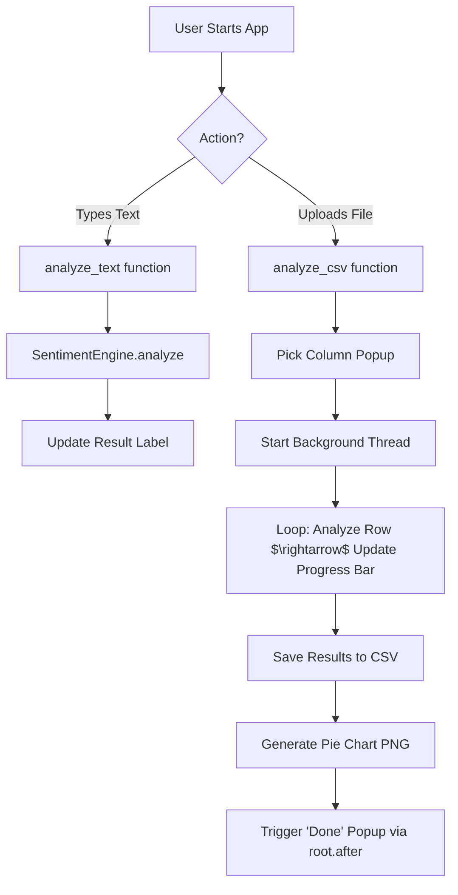

***

# 🧠 Code Explanation — Sentiment Analyzer Pro

This document provides a deep-dive walkthrough of the Sentiment Analyzer. This application is designed to take text (either typed manually or uploaded via CSV/Excel) and determine if the emotional tone is **Positive**, **Negative**, or **Neutral**.

---

## 🚀 High-Level Overview
At its simplest, the app works like this:
**Input (Text)** $\rightarrow$ **The Engine (VADER NLP)** $\rightarrow$ **Classification (Label & Score)** $\rightarrow$ **Output (UI Display / CSV File / Pie Chart)**.

To ensure a professional user experience, the app uses **Multi-threading**, allowing it to process thousands of rows of data in the background without making the window "Freeze" or say "Not Responding."

---

## 📦 The Tech Stack (Libraries)

| Library | Role | Technical Purpose |
|---|---|---|
| `tkinter` | **The Face** | Creates the window, buttons, and layout. |
| `pandas` | **The Accountant** | Handles tabular data (CSV/Excel) and manages columns. |
| `nltk (VADER)` | **The Brain** | A specialized NLP tool that understands sentiment, including sarcasm and negations. |
| `matplotlib` | **The Artist** | Generates the visual pie chart of the results. |
| `threading` | **The Multitasker** | Allows the "Analysis" to run on a separate CPU path so the GUI stays responsive. |
| `os` & `datetime` | **The Organizer** | Manages folders and gives files unique timestamps. |

---

## 🛠️ SECTION 1: The Sentiment Engine (The Brain)

Instead of a loose function, the logic is wrapped in a `SentimentEngine` class. This is a professional design pattern that makes the code reusable and organized.

```python
class SentimentEngine:
    def __init__(self):
        self.sia = SentimentIntensityAnalyzer()
        self.neutral_overrides = {"okay", "ok", "fine", "alright", "average", "moderate"}
```

### 1.1 Why VADER? (For the Pros)
Unlike basic tools that just look for "happy" or "sad" words, **VADER (Valence Aware Dictionary and sEntiment Reasoner)** understands:
- **Negations:** It knows "not good" is negative, whereas a basic tool sees "good" and thinks it's positive.
- **Intensity:** It knows "GREAT!!!" is more positive than "great."
- **Compound Score:** It calculates a "compound score" (from -1 to 1) which is a normalized sum of all words in the sentence.

### 1.2 The Logic Flow: `analyze(text)`
1. **Safety First:** If the input is empty or not a string, it immediately returns `Neutral`. This prevents the app from crashing on empty CSV cells.
2. **The "Neutral Override":** Some words like "okay" or "fine" are technically positive in a dictionary but mean "neutral" in real-life feedback. If a short sentence ( $\le 6$ words) contains these, we force it to be `Neutral`.
3. **The Scoring:** VADER provides the compound score.
   - **Score $\ge 0.05$**: Positive 😊
   - **Score $\le -0.05$**: Negative 😠
   - **Between -0.05 and 0.05**: Neutral 😐

---

## 🧵 SECTION 2: Multi-Threading (The "Pro" Feature)

In standard programming, code runs in one line. If you analyze a CSV with 10,000 rows, the GUI would freeze until it finished. To solve this, we use **Threading**.

### How it works:
- **Main Thread:** Handles the window, buttons, and animations.
- **Worker Thread (`run_analysis_thread`):** Handles the heavy math and file saving.

### The "Thread-Safe" UI Update:
Tkinter is **not thread-safe**, meaning a background thread cannot directly change a label on the screen without risking a crash.
**The Solution:** `root.after(0, lambda: ...)`
This tells the main thread: *"Hey, as soon as you have a free millisecond, please update this label for me."*

---

## 📂 SECTION 3: Bulk CSV/Excel Analysis

This is the most complex part of the app. Here is the step-by-step pipeline:

1. **File Selection:** `filedialog` lets the user pick a `.csv` or `.xlsx` file.
2. **Dynamic Column Selection:** The app reads the file and creates a **Toplevel window** (a popup). It lists all the columns found in the file so the user can choose which one contains the text.
3. **The Processing Loop:**
   - It iterates through every row of the chosen column.
   - It calls the `SentimentEngine` for each row.
   - **Progress Optimization:** It only updates the progress bar every 10 rows. Updating the UI every single row is computationally expensive and would slow down the analysis.
4. **Export:** 
   - It creates a folder called `sentiment_output`.
   - It saves the results as a new CSV with a timestamp (e.g., `sentiment_result_20231027_1230.csv`) so no previous work is ever overwritten.

---

## 📊 SECTION 4: Data Visualization (The Chart)

The `generate_chart` function takes the final results and turns them into a visual story.

- **Value Counts:** `df["Sentiment"].value_counts()` counts how many times "Positive", "Negative", and "Neutral" appear.
- **Color Mapping:** We use specific Hex codes (`#4CAF50` for Green, etc.) to ensure the chart looks modern and professional.
- **Resolution:** `dpi=150` and `bbox_inches="tight"` ensure the image is crisp and has no awkward white borders.

---

## 🎨 SECTION 5: The GUI Design

The interface is built with a "Dark Mode" aesthetic (Catppuccin-inspired) for a modern look.

- **Layout:** It uses a vertical stack.
- **Interactive Elements:**
    - `tk.Text`: For multi-line input.
    - `ttk.Progressbar`: Gives the user visual feedback during long tasks.
    - `ttk.Combobox`: A dropdown menu for clean column selection.
- **Responsiveness:** `root.resizable(False, False)` ensures the carefully placed elements don't shift or overlap if the user drags the window corner.

---

## 🔄 Full Technical Data Flow



---

## 🎓 Key Concepts Summary

| Concept | Simple Explanation | Pro Explanation |
|---|---|---|
| **NLP** | Teaching computers to understand human language. | Natural Language Processing using lexicon-based sentiment analysis. |
| **VADER** | A tool that knows "not bad" is actually "good." | A gold-standard sentiment analysis tool for social media text. |
| **Threading** | Doing two things at once. | Concurrent execution to avoid blocking the Main GUI Event Loop. |
| **DataFrame** | A digital spreadsheet. | A 2D labeled data structure from the Pandas library. |
| **Compound Score** | A single number representing the "mood" of a sentence. | A normalized, weighted composite score of valence. |
| **Thread-Safety** | Making sure two parts of a program don't fight over the same thing. | Ensuring GUI modifications occur only on the Main Thread. |

***
*Built by Anuj Jadhav — High-Performance Sentiment Analysis Tool*